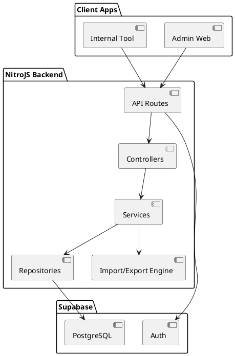

# SPEC-1-NitroJS-Standalone-Backend

## Background

NitroJS will be developed as a standalone backend service designed to support multiple client applications (e.g., web admin panel, potential internal tools, or future external services).

The system will be used exclusively by administrative users. There is no public-facing access. Authentication and data storage will be handled using Supabase (PostgreSQL + Auth).

The core feature set of the system includes:
- Generic CRUD operations for business entities
- Importing structured data via CSV and Excel files
- Exporting structured data via CSV and Excel files
- Generating PDF exports of records or reports

The architecture must:
- Be optimized for a single developer
- Remain clean and maintainable
- Be scalable for future growth
- Support Scrum-based iterative delivery (MVP first, then increments)

The backend will act purely as an API layer with no server-side rendered UI responsibilities.

---

## Requirements

### Must Have
- RESTful API built with NitroJS as standalone Node server
- Supabase PostgreSQL as primary database
- Supabase Auth for admin-only authentication
- Role-based access control (admin role)
- CRUD endpoints for core entities
- CSV import with validation and transactional integrity
- Excel (XLSX) import support
- CSV export of filtered datasets
- Excel export of filtered datasets
- PDF generation for individual records and list reports
- Structured project directory optimized for one developer
- Environment-based configuration (dev/staging/prod)
- Logging and centralized error handling

### Should Have
- Input validation layer (schema-based validation)
- Service layer abstraction separating business logic from controllers
- Repository/data access abstraction
- Background processing for heavy imports (non-blocking)
- API versioning (/api/v1)
- Pagination, filtering, and sorting support

### Could Have
- Job queue system for large file imports
- Audit logging (who imported/exported what)
- Soft deletes
- OpenAPI/Swagger documentation

### Won't Have (MVP)
- Public user access
- Real-time subscriptions
- Complex workflow engine
- Microservices architecture

---

## Method

### 1. High-Level Architecture

NitroJS will run as a standalone Node server exposing REST endpoints.

Architecture style: **Layered Modular Monolith** (scalable, simple for 1 developer).

Layers:
- API Layer (routes/controllers)
- Service Layer (business logic)
- Repository Layer (Supabase data access)
- Infrastructure Layer (file parsing, PDF generation, logging)



---

### 2. Recommended Directory Structure (1 Dev Optimized)

```
/server
  /api
    /v1
      users.ts
      entities.ts
      import.ts
      export.ts

  /modules
    /entity
      entity.controller.ts
      entity.service.ts
      entity.repository.ts
      entity.schema.ts

  /infrastructure
    supabase.client.ts
    logger.ts
    error.handler.ts
    pdf.generator.ts
    csv.util.ts
    excel.util.ts

  /middleware
    auth.middleware.ts
    role.middleware.ts

  /types

  /utils

nitro.config.ts
```

Principles:
- Feature-based modules
- Clear separation of business logic
- Infrastructure isolated
- Easily extensible per entity

---

### 3. Supabase Integration Pattern

- Use Supabase JS client in server-only context
- Service Role key for backend operations
- Row Level Security enabled
- Repository layer wraps Supabase queries

Repository example pattern:

- create(data)
- findById(id)
- findMany(filter, pagination)
- update(id, data)
- delete(id)

All DB calls isolated here.

---

### 4. Database Schema Strategy (Example Entity)

Example: `records`

Fields:
- id (uuid, primary key)
- name (text)
- status (text)
- metadata (jsonb)
- created_at (timestamp)
- updated_at (timestamp)
- deleted_at (timestamp, nullable for soft delete future)

Indexes:
- index on status
- index on created_at

All tables follow same base columns for consistency.

---

### 5. Import Architecture

Flow:
1. Upload file
2. Store temporarily in memory or temp storage
3. Parse (CSV → streaming, XLSX → structured parser)
4. Validate rows using schema
5. Transactional batch insert (chunked 500 rows)
6. Return summary (success/failed rows)

Large files:
- Process asynchronously using internal queue abstraction
- Return job ID

---

### 6. Export Architecture

Export CSV/XLSX:
- Accept filters
- Fetch paginated data
- Stream output

Export PDF:
- Service builds view model
- PDF generator renders template
- Return file stream

PDF generation should use server-side HTML-to-PDF approach for flexibility.

---

### 7. Scalability Strategy

Short Term:
- Single Node instance
- Stateless API
- Supabase managed scaling

Future Scaling:
- Horizontal scaling via container deployment
- Move import processing to queue worker
- Use object storage for large files

---

## Implementation

### Phase 1 – Project Setup
1. Initialize NitroJS standalone project.
2. Configure environment variables (SUPABASE_URL, SUPABASE_SERVICE_KEY).
3. Implement base folder structure.
4. Create Supabase client wrapper (server-only).
5. Implement global error handler and logger.

### Phase 2 – Core Architecture
1. Implement auth middleware (verify Supabase JWT).
2. Implement role middleware (admin check).
3. Create base repository pattern.
4. Implement first entity module (controller/service/repository).
5. Add pagination, filtering, sorting utilities.

### Phase 3 – Import/Export Engine
1. Implement CSV parser (stream-based).
2. Implement XLSX parser.
3. Add schema validation layer.
4. Implement chunked batch insert (500 rows).
5. Implement CSV/XLSX export streaming.
6. Implement PDF generator using HTML template rendering.

### Phase 4 – Hardening
1. Add API versioning (/api/v1).
2. Add structured logging.
3. Add basic audit logging.
4. Add integration tests for CRUD + import.

---

## Milestones

- M1: Project skeleton + Supabase connection
- M2: First CRUD entity production-ready
- M3: CSV import/export working
- M4: XLSX + PDF export complete
- M5: Auth + role middleware hardened
- M6: Production deployment (containerized)

Each milestone should fit inside a Scrum sprint (1–2 weeks).

---

## Gathering Results

Evaluation Criteria:

- CRUD latency < 200ms average
- Import of 10k rows completes < 30 seconds
- No memory leaks during large file processing
- 100% validation coverage before DB insert
- Clear module separation (no cross-layer leakage)

Post-production:
- Monitor error rate
- Monitor DB query performance
- Measure import/export duration
- Conduct code maintainability review after 3 sprints

---

## Need Professional Help in Developing Your Architecture?

Please contact me at [sammuti.com](https://sammuti.com) :)

